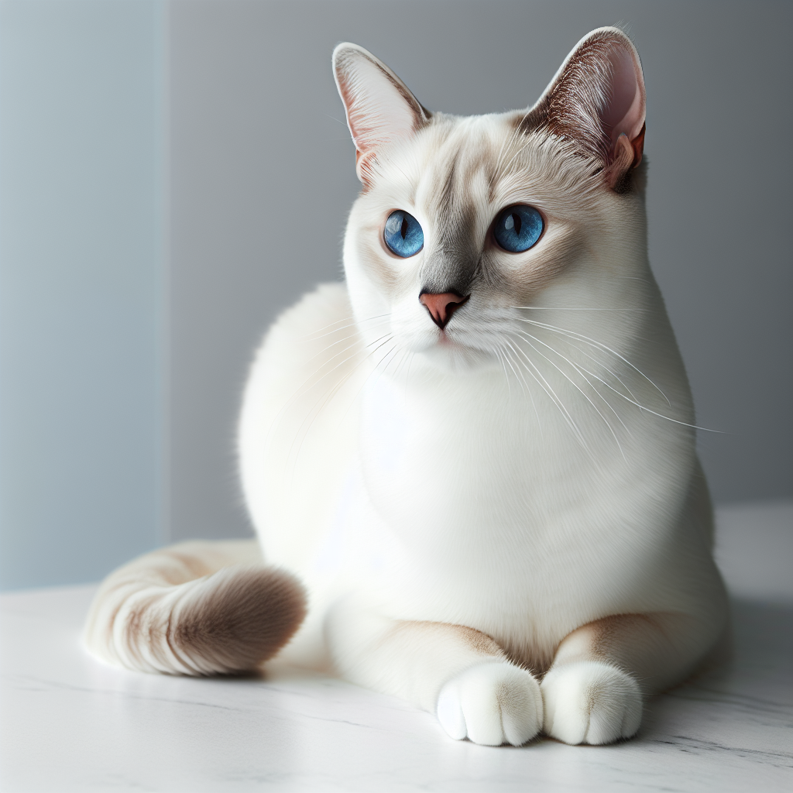

# foundary

## 목표 
- 주어진 전문가의 사진과 사용자의 사진을 입력값으로 하여 가장 좋은 성능으로 사진을 생성해내는 것.
- 시제품에 적용가능한 사진, 템플릿 구축

## 8월 계획
1. ChatGPT API 세팅해둔 것들을 기반으로 각자 폴더 만들어서 수행해보기
   1) ChatGPT API Key를 발급 받아야함.
2. Dall-e, Midjourney 등 생성형 AI 등에 대한 프롬프트 엔지니어링 수행

-> 완수

## 이미지의 종류
1. Chairs
2. Stools & benches
3. Dining tables
4. Cafe tables
5. Desk
6. Lighting

 

=======

# 전체적인 흐름 
- 09/22 아이디어: "이미지를 보고 스타일에 대해 인식을 하는 Agent를 개입해서 그것을 기반으로 프롬프트를 생성해서 활용하여 이미지를 생성하게 한다면 성능은 어떻게 구체화되지 않을까? 그리고 뭔가 창의성에 대한 온도도 조절이 가능하고?"

 

# 이미지를 

(생성된 이미지 예시)
